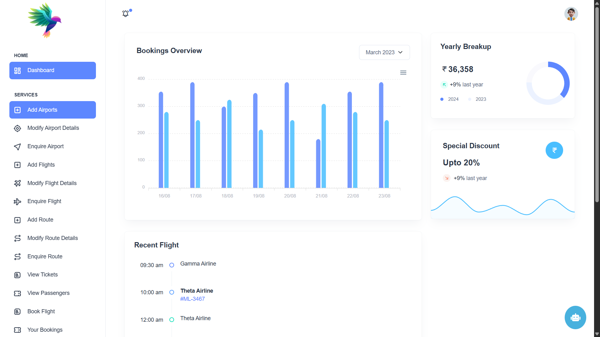
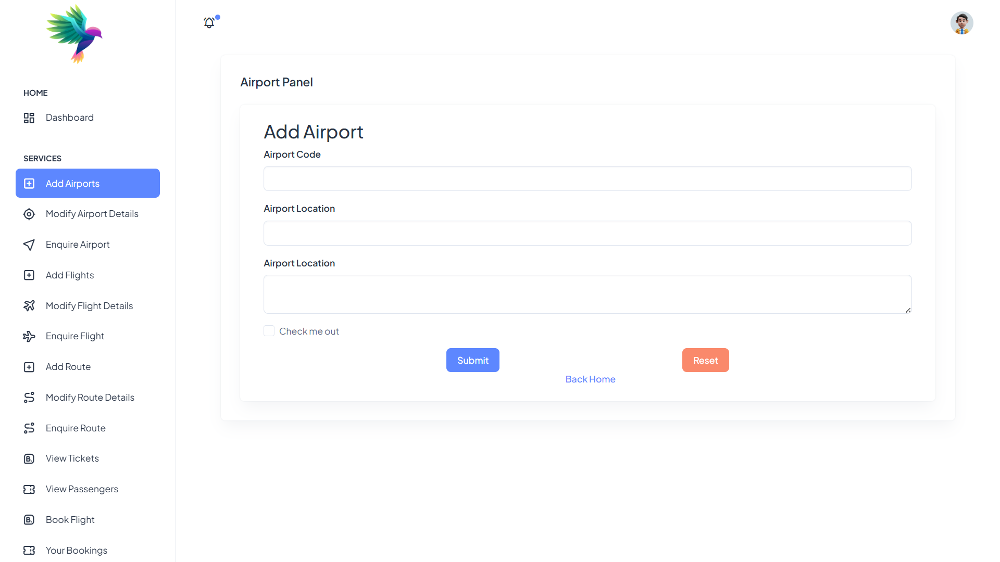
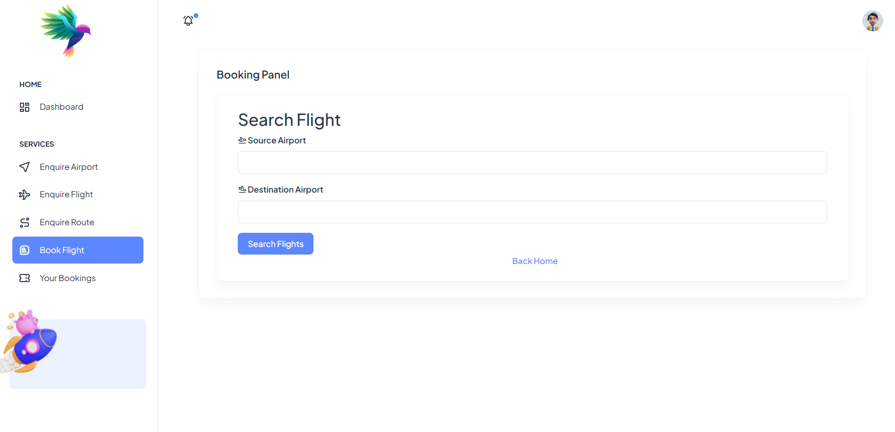
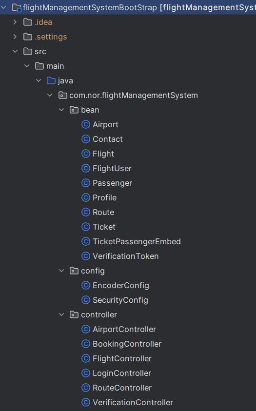
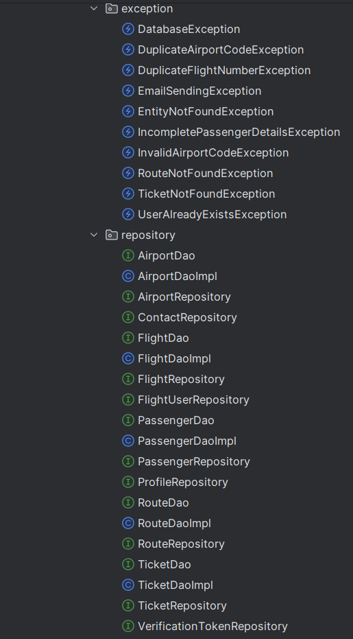
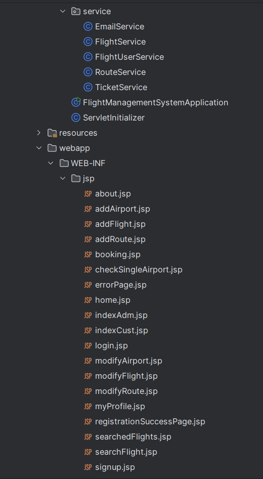
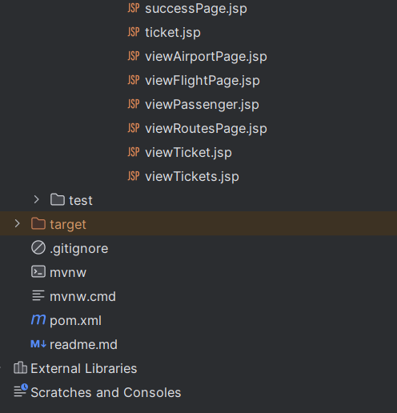
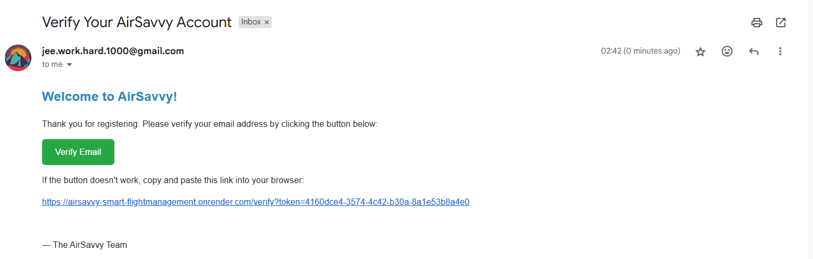

# ✈️ AirSavvy – Smart Flight Management System

## Table of Contents

- [🚀 Introduction](#-introduction)
- [✨ Features](#-features)
- [🛠️ Technologies Used](#️-technologies-used)
- [📦 Installation](#-installation)
- [🧑‍💻 Usage](#-usage)
- [🗂️ Project Structure](#️-project-structure)
- [🔒 Email Verification Flow](#-email-verification-flow)
- [🧠 Gemini Chat Assistant](#-gemini-chat-assistant)
- [🐳 Docker Support](#-docker-support)
- [🌐 Deployment on Render](#-deployment-on-render)
- [🤝 Contributing](#-contributing)

---

## 🚀 Introduction

**AirSavvy – Smart Flight Management System** is a full-stack Java-based web application designed to streamline flight booking, user onboarding, and airline management for both customers and admins.

🔗 **Live App**: [https://airsavvy-smart-flightmanagement.onrender.com](https://airsavvy-smart-flightmanagement.onrender.com)




---

## ✨ Features

- ✅ User registration with email verification
- 🔐 Secure login & authentication
- ✈️ Flight booking, cancellation, and management
- 👨‍✈️ Admin dashboard for airline operations
- 🧑 Profile management with image upload
- 📥 Contact support form
- 🧠 Gemini-powered AI Assistant for user queries
- 📬 Resend verification link support
- 🔍 Search flights dynamically
- 🌐 Deployed on [Render](https://render.com)

---

## 🛠️ Technologies Used

| Layer        | Technology                             |
|--------------|-----------------------------------------|
| Backend      | Java 17, Spring Boot, Spring Security, Spring MVC |
| Frontend     | JSP, JSTL, HTML5, CSS3, Bootstrap       |
| Database     | MongoDB (hosted on MongoDB Atlas)       |
| Build Tool   | Maven                                   |
| AI Assistant | Gemini API via WebClient                |
| SMTP         | Gmail SMTP (via Spring Mail)            |
| Deployment   | Docker + Render                         |
| Authentication | Secure Password Encoding (BCrypt)     |

---

## 📦 Installation

### 1. Clone the repository
```bash
git clone https://github.com/ojasvatstyagi/AirSavvy-Smart-FlightManagement.git
cd AirSavvy-Smart-FlightManagement
```

### 2. Setup MongoDB Atlas
Create an account at MongoDB Atlas
Create a cluster → database user → connect → choose connection string
Replace the following line in application.properties:

```yaml
spring.data.mongodb.uri=mongodb+srv://<user>:<password>@cluster0.mongodb.net/airsavvy?retryWrites=true&w=majority
```

### 3. Setup SMTP (Gmail)
In .env file or application.properties, add:

```yaml
spring.mail.host=smtp.gmail.com
spring.mail.port=587
spring.mail.username=your_email@gmail.com
spring.mail.password=your_app_password
spring.mail.properties.mail.smtp.auth=true
spring.mail.properties.mail.smtp.starttls.enable=true
```
Generate an App Password from your Gmail account (2FA must be enabled).

### 4. Build the project and run the application
```bash
mvn clean install
mvn spring-boot:run
```

---
### 5. 🧑‍💻 Usage
| Feature             | URL Path                     |
| ------------------- | ---------------------------- |
| Home Page           | `/home`                      |
| Register            | `/register`                  |
| Login               | `/loginpage`                 |
| Search Flights      | `/searchflight`              |
| Add Airport (Admin) | `/addAirport`                |
| User Profile        | `/profile`                   |
| AI Assistant        | Floating widget on all pages |

---
### 6. Project Structure
📁 controllers/ – Handles web routes  
📁 services/ – Business logic (Booking, Email, Profile, etc.)  
📁 models/ – Entity models (FlightUser, Token, Flight, etc.)  
📁 repositories/ – Spring Data MongoDB Repositories  
📁 templates/ – JSP Pages (home.jsp, register.jsp, addAirport.jsp, etc.)  
📁 static/ – CSS, JS, images  
📁 config/ – Spring Security config  
📄 Dockerfile – For containerization  
📄 .env – For environment variables






---
### 7. Email Verification Flow
On user registration, a unique token is created and stored in the database.
An email with a styled verification link is sent via SMTP.
Clicking the link verifies the account and enables login. 
📧 Sample Verification Email:

A "Resend Verification Email" option is available on login page if token expires.



---

### 8. 🧠 Gemini Chat Assistant
A floating AI chatbot is integrated using Google Gemini API via Spring WebClient: \
Answers user queries about booking, cancellations, etc.\
Context-aware and improves user experience.\
👨‍💻 Backend: Integrated into Spring Service\
💬 Frontend: Floating chat widget across pages
---

### 9. 🐳 Docker Support
Run your app in a container:

```bash
docker build -t airsavvy .
docker run -p 9090:9090 airsavvy
```

### 10. 🌐 Deployment on Render
Steps:
Push code to GitHub repo\
Login to Render\
Connect repo → Choose Java build\
Set environment variables (SMTP + Mongo URI)\
Enable deploy hook for automatic redeploys
---
### 11. 🤝 Contributing
We welcome contributions!\
Fork the repo\
Create a branch: git checkout -b feature/xyz \
Commit your changes \
Push and open a PR 

📬 Contact
For queries or feedback, feel free to raise an issue or email at: ojasvatstyagi@gmail.com

💡 Built with Java, by a developer who loves clean architecture and building useful systems.
