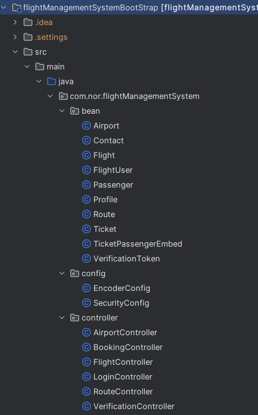
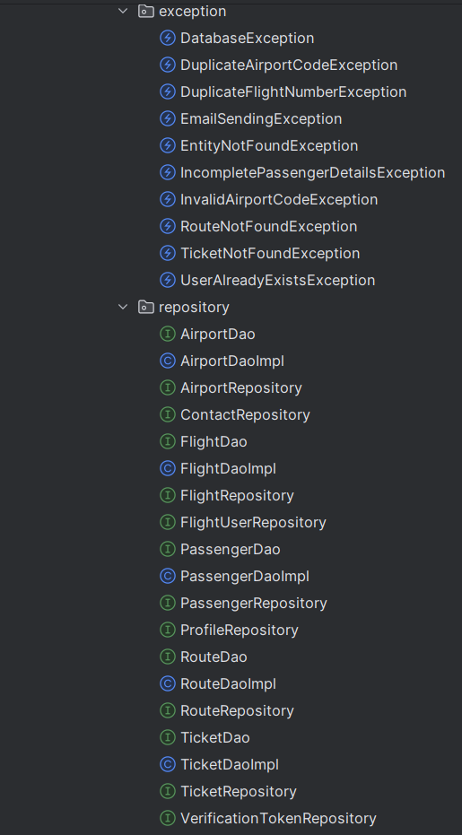
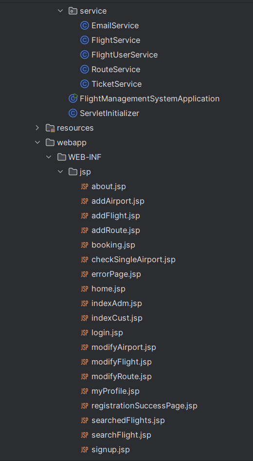
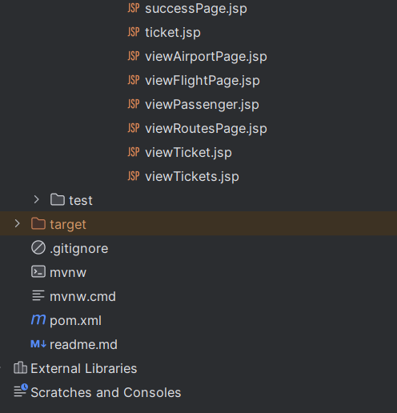

# Flight Management System

## Table of Contents

- [Introduction](#introduction)
- [Features](#features)
- [Technologies Used](#technologies-used)
- [Installation](#installation)
- [Usage](#usage)
- [Project Structure](#project-structure)
- [Contributing](#contributing)

## Introduction

The **Flight Management System** is a web application that leverages Java Spring Boot to manage flight reservations, user registrations, and administrative functionalities. The system is designed to facilitate smooth and efficient handling of flight-related operations for both customers and administrators.

## Features

- User registration and authentication
- Flight booking and cancellation
- Admin dashboard for managing flights
- Dynamic web pages using JSP and JSTL
- Profile management with image upload
- Email verification for user accounts
- Integration with MongoDB for data persistence

## Technologies Used

- **Java Spring Boot**: Framework for building the application.
- **Spring Data JPA**: For database operations.
- **Spring Security**: For securing the application.
- **JSP and JSTL**: For building the front-end.
- **MongoDB**: Database for storing flight and user data.
- **Maven**: Build automation tool.

## Installation

Follow these steps to set up the project locally:

1. **Clone the repository:**
    ```bash
    git clone https://github.com/ojasvatstyagi/flight-management-system.git
    cd flight-management-system
    ```

2. **Update database configurations:**
    - Open `src/main/resources/application.properties`
    - Update the following properties with your MongoDB credentials:
    ```properties
    spring.data.mongodb.uri=mongodb://localhost:27017/yourdbname
    spring.datasource.username=yourusername
    spring.datasource.password=yourpassword
    ```

3. **Build the project:**
    ```bash
    mvn clean install
    ```

4. **Run the application:**
    ```bash
    mvn spring-boot:run
    ```

## Usage

- **Access the application:** Open a web browser and navigate to `http://localhost:9092`.
- **Registration:** Navigate to `/register` to create a new user.
- **Login:** Use `/loginpage` to log in to the application.
- **Profile Management:** After logging in, users can update their profile, including uploading a profile image.
- **Email Verification:** Users must verify their email addresses before they can log in.
- **Admin Access:** Admin-specific functionalities can be accessed after logging in as an admin.

## Project Structure





## Contributing

If you want to contribute to the project, please follow these steps:

1. Fork the repository.
2. Create a new branch.
3. Make your changes.
4. Submit a pull request.
